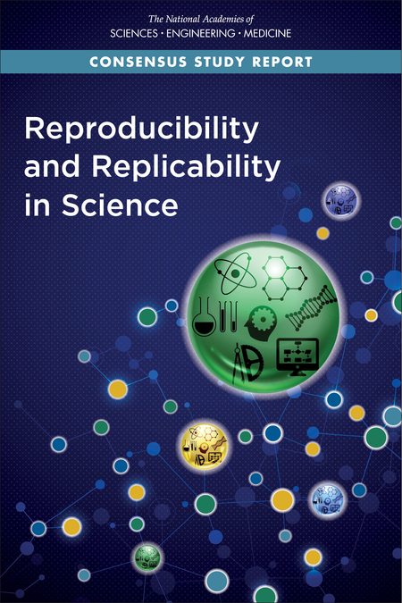

RRP'20 - Reproducibility today
========================================================
author: Carlos Granell
date: March 2020
transition: rotate
css: rpp.css

<small>
[GEOTEC research group](http://geotec.uji.es/)      
Universitat Jaume I
</small>

Quote
===
type: sub-section

Focus is the art of knowing what to ignore.

The fastest way to raise your level of performance: Cut your number of commitments in half.

Research Ecosystem 
===
type: default

[Source](http://www.stodden.net)

Research is a complex ecosystem
===

Community-driven approach to reproducibility ([Granell et al., 2018](https://doi.org/10.7287/peerj.preprints.27216v1))

Institucional/policy level
===
US view (May 2019): [Reproducibility and Replicability in Science](https://www.nap.edu/catalog/25303/reproducibility-and-replicability-in-science):

* reproducibility _vs_ replicability
* recommendatios to improve R&R across science
* target different actors
* education & training

***

Publisher level  
===

[TOP](https://cos.io/top/) (Transparency and Openness Promotion) Guidelines for journals and funders
* 8 modular standards x 3 levels of increasing implementation/adoption

[TOP Factor](https://www.topfactor.org/) 
* Check if journals of your discipline support TOP guidelines!

Publisher level - TOP Guidelines  
===

Publisher level
===

[Vasilevsky et al, 2017](https://doi.org/10.7717/peerj.3208): _Reproducible and reusable research: are journal data sharing policies meeting the mark?_

* Sample: 318 biomedical journals 
* Review on data sharing policies:required, recommended, required only for omics data, or not addressed at all.
  * 12% required data sharing as a condition of publication
  * 9%  required data sharing
  * 15% required it for omics data
  * 23% encouraged data sharing
  * 40% no mention to data sharing 

Publisher level
===

Software/code Journals: 
* [Journal of Open Research Software](https://openresearchsoftware.metajnl.com/), [Journal of Open Source Software](https://joss.theoj.org/), [The R Journal](https://journal.r-project.org/), [SoftwareX](https://www.journals.elsevier.com/softwarex)

Reproducible experiments journals: 
* [ReScience X](http://rescience.org/x), [ReScience C](http://rescience.github.io/), [Experimental Results](https://www.cambridge.org/core/journals/experimental-results), [Advances in Methods and Practices in Psychological Science](https://journals.sagepub.com/home/amp), [Quarterly Journal of Political Science](https://www.nowpublishers.com/QJPS)

Data journals: 
* [Data in Brief](https://www.journals.elsevier.com/data-in-brief), [Scientific Data](https://www.nature.com/sdata/), [GigaScience](https://academic.oup.com/gigascience), [Data](https://www.mdpi.com/journal/data)

Instituticional/Publisher level 
===

If data _IS_ a key outcome, publish it a data journal
* follow journal guidelines, either propietary (eg [SAGE](https://www.data-planet.com/)) or public repositories

If data _IS NOT_ key but valuable, deposit/publish it in __public repositories__

* Find the right repository for your data: [re3data.org](http://re3data.org/), [Repository Finder](https://repositoryfinder.datacite.org/)

* Use thematic repositories for your discipline

* Use general-purpose repositories ([Zenodo](https://zenodo.org/), [figshare](https://figshare.com/)) 

Community level 
===

Initiatives/Projects: 

* [Codecheck](https://codecheck.org.uk/): independent reproduction of computations in research papers.

* [Opening Reproducible Research](https://o2r.info/) (O2R): developing Research Compendium.

* [Whole Tale](https://wholetale.org/): infrastructure for reproduction

* [Papers with Code](https://paperswithcode.com/): Machine Learning papers & code & evaluation tables. 

* [Frictionless Data for reproducible research](http://frictionlessdata.io/reproducible-research/) (by OKF).

Community level 
===
  
Conferences & associations:
* [ACM badges](https://www.acm.org/publications/policies/artifact-review-badging)
* [NeurIPSConf](https://neurips.cc/)
* [SIGMOD](http://db-reproducibility.seas.harvard.edu/)
* [PVLDB Reproducibility](https://www.vldb-repro.com/)
* [AGILE](https://agile-online.org/)

Research Group level
===

* [Victoria Stodden](ttp://www.stodden.net)
* [Lorena Barba](https://lorenabarba.com/)
* [Brian Nosek](https://cos.io/about/team/brian-nosek-co-founder-and-executive-director/)
* ...your research group... 

Individual level
===

This course is about __training__ on computational research practices!

We'll see many resources along the course both __general__ recommendations:
* [Ten simple rules collection](https://collections.plos.org/ten-simple-rules): _must-read!_
* [Sandve et al., 2013](https://dx.doi.org/10.1371/journal.pcbi.1003285): _Ten simple rules for reproducible computational research_
* [Wilson et al., 2017](https://dx.doi.org/10.1371/journal.pcbi.1005510): _Good enough practices in scientific computing_
 
Individual level
===

and __specific__ recommendations:
* British Ecological Society (BES), [guides to better science](https://www.britishecologicalsociety.org/publications/guides-to/)
* [Nüst et al., 2019](https://doi.org/10.17605/OSF.IO/CB7Z8): _AGILE Reproducible Paper Guidelines_
* [Rule et al., 2019](https://dx.doi.org/10.1371/journal.pcbi.1007007): _Ten simple rules for writing and sharing computational analyses in Jupyter Notebooks_  

Discussion
===

Explore the list of helpful guides in [“Ten Simple Rules” collection](https://collections.plos.org/ten-simple-rules), and choose a couple to read carefully.

Find a handful of data repositories that match your research topics. Rank them in order of preference. 

Check out the data & code sharing policies of your usual journals. Study their policies. Otherwise, find alternatives to publish!

Pick a [topic](https://paperswithcode.com/sota) and explore their papers & code.  

