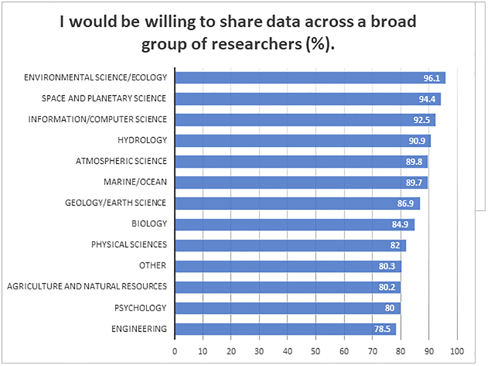
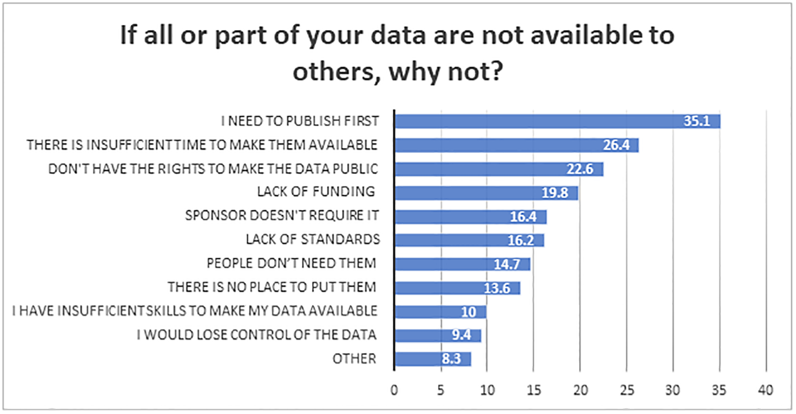

RRP'20 - Phd thesis meets reproducibility
========================================================
author: Carlos Granell
date: March 2020
transition: rotate
css: rpp.css

<small>
[GEOTEC research group](http://geotec.uji.es/)      
Universitat Jaume I
</small>

Quote
===
type: sub-section

You can't guarantee success, but you can guarantee failure: never try.

What does research mean for a PhD thesis today?
===

Claim #1 
> All published research today has a computational component.

Claim #2 
> There is a mismatch between the traditional scientific process and computation, leading to reproducibility concerns.

What does research mean for a PhD thesis today?
===

What about you?:
* Is your research dependent on computation ?
* Which computational tools do you use? Do you use them sporadically or frequently? 
* In which phases do you use? 
  * data collection, data storage, data anlysis, data visualisation, 
  * writing, dissemination/presentation, communication
* Are general-purpose (Word, ...) or specific (SSPS,...) tools?

What does research mean for a PhD thesis today?
===

Sequel of _Tenopir and colleagues_ on __data sharing__ in academia
* [Tenopir et al., 2011](https://doi.org/10.1371/journal.pone.0021101): _Data Sharing by Scientists: Practices and Perceptions_ 
* [Tenopir et al., 2015](https://doi.org/10.1371/journal.pone.0134826): _Changes in data sharing and data reuse practices and perceptions among scientists worldwide_ 
* [Tenopir et al., 2020](https://doi.org/10.1371/journal.pone.0229003): _Data sharing, management, use, and reuse: Practices and perceptions of scientists worldwide_

Tenopir et al., (2020) - Disciplines
===

Tenopir et al., (2020) - Barriers
===

What does research mean for a PhD thesis today?
===

What about you?:

* Do your colleagues in your discipline share data?
* Do you share all or part of your data?
* Would you like to share data?
* Which are the main barriers you face to data sharing? 

What does research mean for a PhD thesis today?
===

Claim #1 All published research today has a computational component.
> Computational reproducibility 

Claim #2 There is a mismatch between the traditional scientific process and computation, leading to reproducibility concerns.
> Transparent research

What does reproducibility mean for a PhD thesis?
===

If you’re not convinced yet, take a look at “Five selfish reasons to work
reproducibly” [Markowetz, 2015](https://doi.org/10.1186/s13059-015-0850-7)

* #1: reproducibility helps to avoid disaster
* #2: reproducibility makes it easier to write papers
* #3: reproducibility helps reviewers see it your way
* #4: reproducibility enables continuity of your work
* #5: reproducibility helps to build your reputation

What's your choice?
===

#1 __Business as usual__ scenario, and irreproducible work remains the norm (see - [Chue Hong et al., 2015](https://arxiv.org/abs/1504.00062): _Top Tips to Make Your Research Irreproducible_)

#2 Or you care about __transparency and reproducibility__, and you are excited to acquire new reproducible research practices and habits! 

Discussion
===

Depending on your own interest and research topic, find a few additional informal readings
and blog posts in this [extensive collection about reproducibility in research](https://www.sciencegeist.ch/topic/reproducibility)

Write a list of obstacles for reproducibility that potentially apply to your work. Note
down a solution for each of them from the read articles

