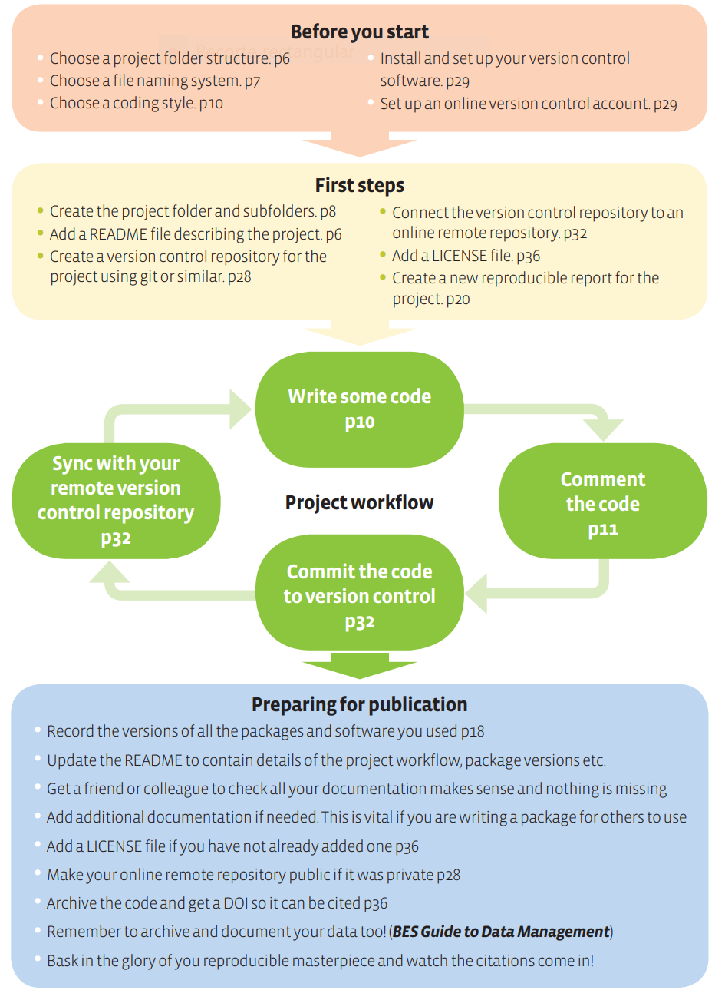

RRP'20 - Before you start
========================================================
author: Carlos Granell
date: March 2020
transition: rotate
css: rpp.css

<small>
[GEOTEC research group](http://geotec.uji.es/)      
Universitat Jaume I
</small>


A simple reproducible project workflow
===


***

- Top two boxes:
  - 02_02: Before you start 

Prerrequisites
===

Remember: our focus is on __computational reproducibility__

Next practices mostly applied to those of you that have never coded 
- If you code regularly, adapt them to make your workflow more reproducible 


Practices
===

#1 Folder organisation

#2 Use a consistent naming convention 

#3 Choose a coding style

#4 (Set-up and) use your version control sofware of choice

#5 (Set-up and) use your online code repository service of choice


#1 Folder organisation
===

- One folder = one project

- Choose your best way to organise a folder
  - Make sure it's consistent, informative and work for you 
  - My [folder template](https://github.com/cgranell/rr-template). _Explore & fork!_

- Create new subfolders as you need
- Add README files in subfolders to describe metadata or content of folders


#2 Consistent naming convention 
===


[Source](http://phdcomics.com/comics/archive.php?comicid=1531)

***

- Name things in machine- and human-readable manner
- Order by default: 
  - For scrips, start file names with numbers indicating the position of the script in the analysis: `01_download_data.R`
  - for data, you can use dates as prefix: `20200115_survey.csv`

#3 Coding style 
===

Depends on the programming language of choice

Adopt a consistent coding style: 
- commenting code: the _'why'_ rather than the _'what'_
- writing functions
- naming variables
- portable code: avoid absolute paths; use only relative paths ([here package](https://cran.r-project.org/web/packages/here/index.html) in R)
  
***


```r
library(here)

here("")
```

```
[1] "C:/MyCode/rrp20"
```

#4 Version control software 
===

Version Control System (VCS): 
  - Tools: SVN, Mercurial, [Git](https://git-scm.com/)
  - [An introduction to Git: what it is, and how to use it](https://www.freecodecamp.org/news/what-is-git-and-how-to-use-it-c341b049ae61/) 

Advantages for reproduction:
- keeps track of the various versions of your work
- provides a complete historical log of your project 
- was designed to handling text format (code, text documents, markdown documents) as opposed to rich/binary formats (Word) 

#5 Online code repositories services 
===

Web-based platform for hosting code repositories:
- VCS + collaborative features
- Platfoms: [GitLab](https://about.gitlab.com/), [Bitbucket](https://bitbucket.org/), [GitHub](https://github.com/)

Further readings:
- [Perez-Riverol et al., 2016](https://doi.org/10.1371/journal.pcbi.1004947): _Ten simple rules for taking advantage of Git and GitHub_
- [Cookiecutter Data Science](https://drivendata.github.io/cookiecutter-data-science/): _Best practices for organising your repository for easy version control_


Summary
===

Simple, commonsense, and easy to apply practices. _Start using them from now on!_

Be organised and consistent is a great step to enabling reproduction
- No need to come up with new file/folder names for every new project
- Optimise your workflow
- Add progresively tools (git, github) into your workflow

