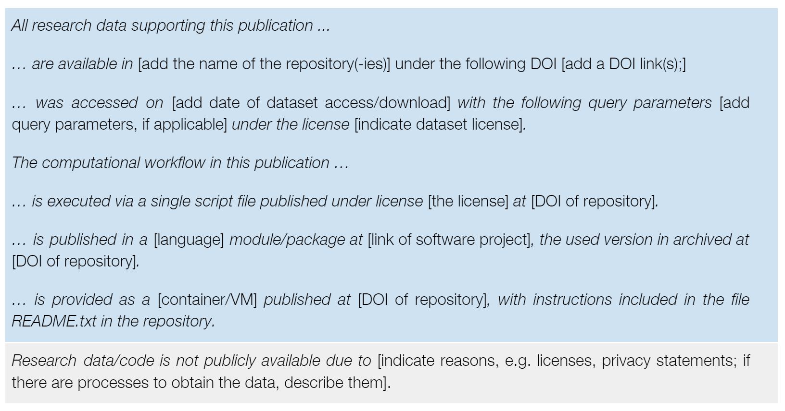
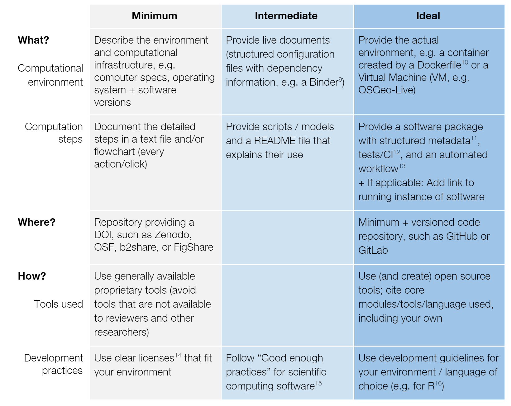

RRP'20 - Guidelines to write reproducible papers 
========================================================
author: Carlos Granell
date: March 2020
transition: rotate
css: rpp.css

<small>
[GEOTEC research group](http://geotec.uji.es/)      
Universitat Jaume I
</small>

A simple reproducible project workflow
===

***

- Bottom box
  - 04: RRP - Writing and dissemination

Practices
===

#1 Follow available practices and guidelines 

#2 Cite data/software in your papers 

#1 Follow practices and guidelines
===

In general: 
- Write your papers in plain text format (markdown, latex. etc) that permits version controls
- Use online tools ([manubot](https://manubot.org/)) or packages ([`rticles`](https://github.com/rstudio/rticles)) that support change traking, reference management, cross-reference, etc.

In particular: 
- Follow _general enough_ practices and guidelines (across disciplines) 
- Follow specific guidelines in your discipline 
- Follow specific guidelines provided by target journals

#1 Follow practices and guidelines
===

Further readings:
- [Wilson et al., 2017](https://dx.doi.org/10.1371/journal.pcbi.1005510): _Good enough practices in scientific computing_
- [Rule et al., 2019](https://dx.doi.org/10.1371/journal.pcbi.1007007): _Ten simple rules for reproducible research in Jupyter notebooks_
- [Nüst et al., 2018](https://doi.org/10.17605/OSF.IO/CB7Z8): _AGILE Reproducible Paper Guidelines_
- [Stodden & Miguez, 2014](http://doi.org/10.5334/jors.ay): _Best Practices for Computational Science: Software Infrastructure and Environments for Reproducible and Extensible Research_

#1 AGILE Guidelines [Nüst et al., 2018]
===

Add a **Data and Software Availability** section to your *methods* section to make explicit where data and software can be accessed (or why they cannot) - [Example](https://doi.org/10.2196/14897)

#1 AGILE Guidelines - Data 
===

Go progressively from *minimun* to *ideal*  

#1 AGILE Guidelines - Code
===

#2 Cite data/software 
===

Cite papert in software/data journals. Otherwise, use citation principles below.

Further readings:
- [Parson et al., 2019](https://doi.org/10.5334/dsj-2019-052): _The History and Future of Data Citation in Practice_
- [Callaghan, 2014](https://www.force11.org/datacitationprinciples): _Joint declaration of data citation principles_
- [Smith et al., 2016](https://doi.org/10.7717/peerj-cs.86): _Software citation principles_
- [Stodden & Miguez, 2014](http://doi.org/10.5334/jors.ay): _Best Practices for Computational Science: Software Infrastructure and Environments for Reproducible and Extensible Research_

  
