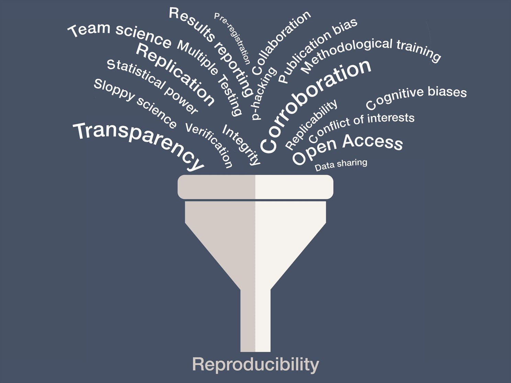

# Quote

Focus is the art of knowing what to ignore.

The fastest way to raise your level of performance: Cut your number of commitments in half.

## The profession of the scientist

- Why are you a scientist/researcher?

- What are your motivations?

## The profession of the scientist

__Intrinsic__ motivations:

> - "locos por investigar"
> - avance knowledge
> - make a better world!

__Extrinsic__ motivations:

> - financial incentives
> - move up the career ladder
> - recognition by peers, society

## Reproducibility in Science

Doubt is inherently human and we (scientists) always have doubts!

- (Well, that doesn’t mean it’s OK to keep questioning climate change, evolution, and the power of vaccines...)

Avancing science and knowledge requires:

- __openness__,
- __transparency__,
- __reproduction__ and   
- __cumulative evidence__ (reviews)

# Reproducibility in Science

## Reproducibility in Science

