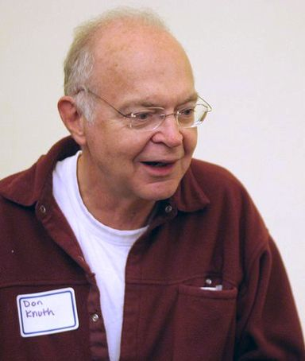

<!--
layout: true

background-image: url(http://geotec.uji.es/wp-content/uploads/2016/11/geotecLOGO.fw_.png)
background-position: 0% 100%  bottom left
background-size: 15%


<div class="my-footer"><span>geotec.uji.es</span></div>

this adds the link footer to all slides, depends on my-footer class in css-->

```{r setup, include=FALSE}
options(htmltools.dir.version = FALSE)
```

```{r, load_refs, include=FALSE, cache=FALSE}
library(RefManageR)
library(here)

BibOptions(check.entries = FALSE,
           bib.style = "authoryear",
           cite.style = "alphabetic",
           style = "markdown",
           first.inits = FALSE,
           hyperlink = FALSE,
           dashed = FALSE)

path_bib <- here::here("content", "xaringa", "references.bib")
my_refs <- RefManageR::ReadBib(path_bib, check = FALSE, .Encoding = "UTF-8")
```

```{r include=FALSE}
citation <- function(refs, id, with_url) {
  ref_cit <- RefManageR::Cite(refs, id)
  
  if (missing(with_url)) {
    return (ref_cit)
  } else {
    ref_url <- refs[id]$url
    return (paste0("[",
                   ref_cit,
                   "](",
                   ref_url,
                   ")"))
  }
}

citation_title <- function(refs, id) {
  ref_cit <- refs[id]
  
  return (ref_cit$title)
}
```

---
class: inverse, center, middle

## Focus is the art of knowing what to ignore.

### The fastest way to raise your level of performance: Cut your number of commitments in half.

---

# The profession of the scientist 

- Why are you a scientist/researcher?

- What are your motivations?

---

# The profession of the scientist 

.pull-left[
__Intrinsic__ motivations:
- "locos por investigar"
- avance knowledge
- make a better world!
]

.pull-right[
__Extrinsic__ motivations:
- financial incentives
- move up the career ladder
- recognition by peers, society
]

---
class: inverse, center, middle

# Reproducibility in Science


---
# Reproducibility in Science

Doubt is inherently human and we (scientists) always have doubts!

- (Well, that doesn’t mean it’s OK to keep questioning climate change, evolution, and the power of vaccines...)

Avancing science and knowledge requires:

- __openness__,
- __transparency__,
- __reproduction__ and   
- __cumulative evidence__ (reviews)

---


---
class: center, middle

# Is reproduciblity a new problem?

Let's go back to the 17th century...


---
# Is reproduciblity a new problem

Boyle's [air-pump](https://en.wikipedia.org/wiki/Air_pump) was one of the first documented disputes over reproducibility...
-  Dutch scientist [Christiaan Huygens](https://en.wikipedia.org/wiki/Christiaan_Huygens) reported an new effect he termed "anomalous suspension" in Amsterdam.
- [Robert Boyle](https://en.wikipedia.org/wiki/Robert_Boyle) in UK could not replicate this phenomenon in his own air pump.
- Huygens was invited to UK (1663) to personally help Boyle __replicate__ anomalous suspension of water.

[Source](https://en.wikipedia.org/wiki/Reproducibility)

---

# Is reproduciblity a new problem?

.pull-left[
[Francis Bacon](https://en.wikipedia.org/wiki/Works_by_Francis_Bacon) (1561–1626) 
  - a pioneer of the scientific method.
]

.pull-right[

]

---

# Is reproduciblity a new problem?

.pull-left[
[Robert Boyle](https://en.wikipedia.org/wiki/Robert_Boyle) (1627–1691)
  - a pioneer of the experimental method.
  - "By repeating the same experiment over and over again, the certainty of fact will emerge."
]

.pull-right[

]

---
class: center, middle

## Is reproduciblity a new problem?

Let's go back to 40 years ago, with the birth of personal computers...

---

# Is reproduciblity a new problem?

.pull-left[
[Donald E Knuth](https://en.wikipedia.org/wiki/Donald_Knuth) (1938-):
- [Literate programming](https://en.wikipedia.org/wiki/Literate_programming): a new methodology of programming. `r citation(my_refs, "knuth1984")`
- In LP, a programme combines human language and code snippets.
- "Programs are meant to be read by humans, and only incidentally for computers to execute."
]

.pull-right[

]

---
class: center, middle

## Is reproduciblity a new problem?

Let's go back to 30 years ago, with the birth of Internet...

---


# Is reproduciblity a new problem?

.pull-left[
`r citation(my_refs, "claerbout1992", with_url="yes")`: _`r citation_title(my_refs, "claerbout1992")`_

- Executable digital notebook
- Be open + help others
- Document for future self
]

.pull-right[

]

---

# Is reproduciblity a new problem?

.pull-left[
No, it is not _new_, but it _is_ still a problem. 

In 2015, [1,500 scientists lift the lid on reproducibility](https://www.nature.com/news/1-500-scientists-lift-the-lid-on-reproducibility-1.19970)
- more than 70% of researchers have tried and failed to reproduce another scientist's experiments
- more than 50% have failed to reproduce their own experiments
]

.pull-right[

]

---

# Is reproduciblity a (new) problem?

.pull-left[

]

.pull-right[

]

---

# Is reproduciblity a (new) problem?

There is an extensive literature on the __reproducucibility crisis__:

- In scientific studies in general, across various disciplines. See `r citation(my_refs, "ioannidis2005", with_url="yes")`: _`r citation_title(my_refs, "ioannidis2005")`_

- In economics. See [Ioannidis, Stanley & Doucouliagos, 2017](https://doi.org/10.1111/ecoj.12461): _The Power of Bias in Economics Research_

- In medical chemistry. See [Baker, 2017](https://doi.org/10.1038/548485a): _Check your chemistry_

- In neuroscience. See [Button et al, 2013](https://doi.org/10.1038/nrn3475): _Power failure: why small sample size undermines the reliability of neuroscience_

---

# Is reproduciblity a (new) problem?

.pull-left[
[Baker, 2015](https://doi.org/10.1038/nature.2015.17433): _First results from psychology’s largest reproducibility test_

- Only 39 out ot 100 of the published studies in psychology could be reproduced.
]

.pull-right[

]

---

# Is reproduciblity a (new) problem?

Some argue there is not a such reproducibility crisis.

[Fanelli, 2018](https://doi.org/10.1073/pnas.1708272114): _Is science really facing a reproducibility crisis, and do we need it to?_

> The new “science is in crisis” narrative is not only empirically unsupported, but also quite obviously counterproductive. Instead of inspiring younger generations to do more and better science, it might foster in them cynicism and indifference. Instead of inviting greater respect for and investment in research, it risks discrediting the value of evidence and feeding antiscientific agendas.

---
class: inverse, center, middle

## The concept of reproduction 

---

# The concept of reproduction 

Fundamental objectives of scientific research:
- Discover laws, axioms, rules, etc. and describe them and under which condition they apply
- Conduct case studies to prove a general principle (“proof-of-concept”)
- Transfer/publish results to prove validity, veracity, trust in findings

Are you a _rationalist_ or an _empiricist_? 

---

# The concept of reproduction 

> One of the pathways by which scientists confirm the validity of a new
finding or discovery is by repeating the research that produced it.


> Observed inconsistency may be an important precursor to new discovery while 
others fear it may be a symptom of a lack of rigor in science

---

# The concept of reproduction 

We define _reproducibility_ to mean __computational reproducibility__

- Computation has a large and increasing role in scientific research
  - X-informatics: bio-informatics, geo-informatics, ...
  - [The Transformation of the Desk](https://www.youtube.com/watch?v=M_rfujuRHUU)

- If results are produced by complex computational processes, the methods section of a scientific paper is no longer sufficient. 

---

# The concept of reproduction 

__Re__{producible,plicable,create}: [Claerbout & Karrenbach, 1992](https://doi.org/10.1190/1.1822162); [Donoho et al, 2009](https://doi.org/10.1109/MCSE.2009.15); [Peng, 2011](https://doi.org/10.1126/science.1213847); [Barba, 2018](https://arxiv.org/abs/1802.03311): 

- __Reproducible research__: Authors provide all the necessary data and the computer codes to run
the analysis again, re-creating the results.

- __Replication__: A study that arrives at the same scientific findings as another study, collecting new
data (possibly with different methods) and completing new analyses.

---

# The concept of reproduction 

If you read one article, read this one! [Leek & Jager, 2017](https://doi.org/10.1146/annurev-statistics-060116-054104)

- __Reproducibility__: A study is reproducible if all of the code and data used to generate the numbers and figures in the paper are available and exactly produce the published results.

- __Replicability__: A study is replicable if an identical experiment can be performed like the first study and the statistical results are consistent.

- __False discovery__: A study is a false discovery if the result presented in the study produces the wrong answer to the question of interest.

---

# The concept of reproduction 

Our definition: [Ostermann & Granell, 2017](https://doi.org/10.1111/tgis.12195); [Nüst et al., 2018](https://doi.org/10.7717/peerj.5072)

> A reproducible paper ensures a reviewer or reader can recreate the computational workflow of a study or experiment, including the prerequisite knowledge and the computational environment. The former implies the scientific argument to be understandable and sound. The latter requires a detailed description of used software and data, and both being openly available.

---

# The concept of reproduction 

[Peng, 2011](https://doi.org/10.1126/science.1213847): _Reproducibility spectrum_


---

# The concept of (pre-)reproduction 

.pull-left[
[Stark, 2018](https://doi.org/10.1038/d41586-018-05256-0): _preproducibility_
- "Science should be ‘show me’, not ‘trust me’; it should be ‘help me if you can’, not ‘catch me if you can’. 
- "If I publish an advertisement for my work (that is, a paper long on results but short on methods) and it’s wrong, that makes me untrustworthy. 
- "If I say: ‘here’s my work’ and it’s wrong, I might have erred, but at least I am honest". 
]

.pull-right[

]

---

# Summary

Reproducibility is the easiest of these problems to define and assess. 

Computational reproducibility involves:
- checking the published manuscript, 
- looking for published data and code, then 
- comparing the results of that data and code to the published results. 

> If they are the same, the study is reproducible;
> otherwise, the study is not.

---

# Summary 

Reproducibility involves the _original_ data and code.

Replicability involves _new_ data collection to test for consistency with previous results of a smiliar study.

> Even when paper is computationally reproducible, it may fail to be replicated

---

# Discussion

Write a list of obstacles for reproducibility that potentially apply to your discipline. Examples:
- Complex instrumentation: high-performance computation facilities, etc.
- Nonpublic information: patient records, human subject data, etc.
- Complex data gathering: multiple sensors, models, etc

---
name: refs

# References

```{r print_refs, echo=FALSE, results="asis"}
PrintBibliography(my_refs)
```