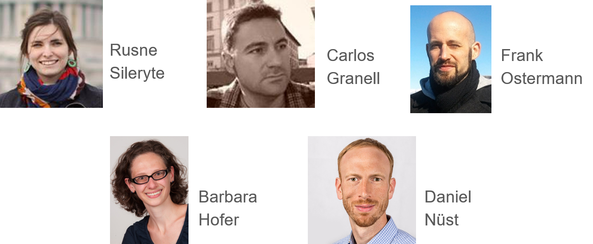
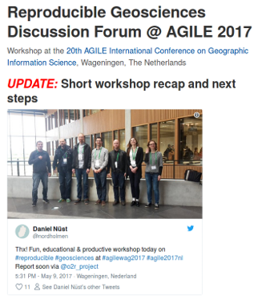
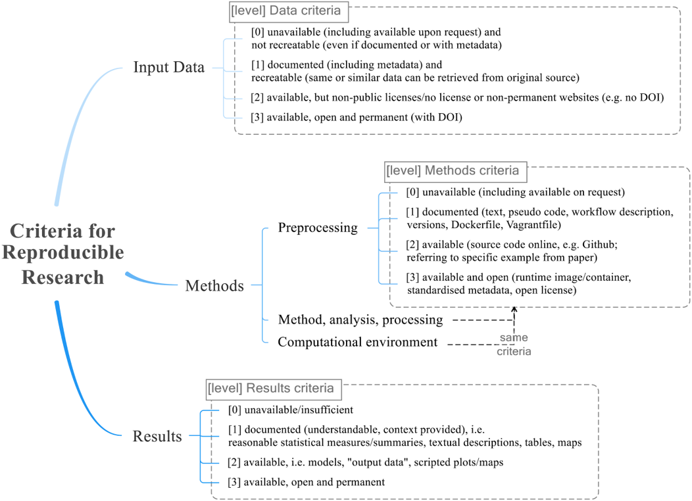
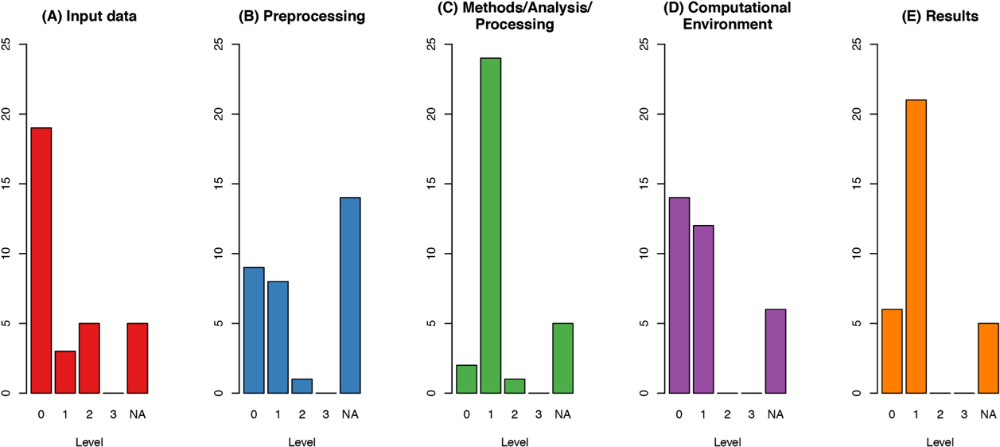
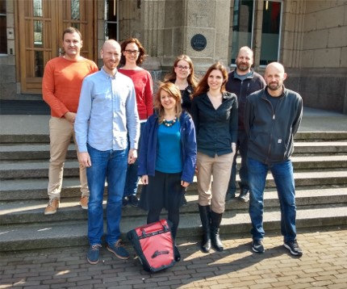

layout: true

background-image: url(http://geotec.uji.es/wp-content/uploads/2016/11/geotecLOGO.fw_.png)
background-position: left bottom
background-size: 15%


```{r setup, include=FALSE}
options(htmltools.dir.version = FALSE)
```

```{r, load_refs, include=FALSE, cache=FALSE}
library(RefManageR)
library(here)

BibOptions(check.entries = FALSE,
           bib.style = "authoryear",
           cite.style = "alphabetic",
           style = "markdown",
           first.inits = FALSE,
           hyperlink = "to.doc",
           dashed = TRUE,
           max.names = 2)

path_bib <- here::here("content", "xaringa", "references.bib")
my_refs <- RefManageR::ReadBib(path_bib, check = FALSE, .Encoding = "UTF-8")
```

---

# Who we are





---
class: inverse, center, middle

## Our history

---

# Reproduciblity @ AGILE 

We're a group of enthusiasts on __Open Science__ and __Reproducibility Research Practices__ (RRP) in GIScience

GIScience = Geographic Information Science

Our web site: [Reproducible Research @ AGILE](https://o2r.info/reproducible-agile)
* List of activities done since 2017
* Access to resources created

`r Cite(my_refs, "granell2020")` describes our past activities and main achievements

---

# Timeline: 2017

.pull-left[
[1st Workshop](https://o2r.info/reproducible-agile/2017) at AGILE 2017 conference (Wageningen)
- We met and agreed on next actions
- Level of reproducibility of AGILE papers?
]

.pull-right[

]

---

# Timeline: 2018

.pull-left[
`r Cite(my_refs, "nust2018")`: _`r my_refs["nust2018"]$title`_
- Definition of reproducibility criteria
- Analysis of 32 AGILE papers based on such criteria
- Assessments with authors
- Recommendations for GIS conferences
]

.pull-right[

]

---
class: center

# Nüst et al. (2018): Reproducibility criteria



---

# Nüst et al. (2018): Analysis

Average reproducibility level: between 0 and 1 (poor)



---

# Nüst et al. (2018): Survey authors

Main feedback from authors on why reproducibility was not increased:
- Legal restrictions
- Lack of time
- Lack of tools
- Lack of knowledge
- Lack of incentives


---

# Timeline: 2018

.pull-left[
[2nd Workshop](https://o2r.info/reproducible-agile/2018/) at AGILE 2018 conference (Lund)
- Presented results of Nüst et al. (2018)
- Hands-on exercise: reproduce that paper!
- Discussion:
  - Yeah, reproduction is important, but need for __training and guidelines__ 
]

.pull-right[

]

---

# Timeline: 2018

.pull-left[
`r Cite(my_refs, "granell2018")`: _`r my_refs["granell2018"]$title`_
- Community-driven approach to reproducibility 
- More on next slide deck
]

.pull-right[

]

---

# Timeline: 2019

.pull-left[
[AGILE Initiative](https://o2r.info/reproducible-agile/initiative/) to develop authors guidelines for AGILE conference submissions to improve reproducibility.
- Recruited 4 experts & met 2 days in Delft (Apr 2019) to discuss and write the guidelines
- [Web site with resources](https://osf.io/phmce/)
]

.pull-right[

]


---

# AGILE Reproducible Paper Guidelines

.pull-left[
`r Cite(my_refs, "nust2019")`: _`r my_refs["nust2019"]$title`_
- Short and concise (6 pages)
- Pre-submission reproducibility chekclist
- From _minimum_ to _ideal_ reproduction level
- Translations: 
  - Spanish `r Cite(my_refs, "granell2019")`; 
  - German (forthcoming)
]

.pull-right[

]


---

# Timeline: 2019

.pull-left[
[3rd Workshop](https://o2r.info/reproducible-agile/2019/) at AGILE 2019 conference (Limassol)
- Presented Guidelines
- Hands-on exercise: basic and avance!
- Guidelines adopted in AGILE 2020 conference 
]

.pull-right[

]

---

# Timeline: 2020

Paper out with our history: `r Cite(my_refs, "granell2020")`

AGILE 2020 & workshop _cancelled_
- 50% of full paper submissions provided reproducibility section anf resources (data, code)

Ongoing activities:
- analysis of papers published in past GIScience conferences 
- more education resources (like this course!)
- engage more people in the initiative
- formalise collaboration through project proposals


---

# References

```{r print_refs1, echo=FALSE, results="asis"}
PrintBibliography(my_refs)
```

