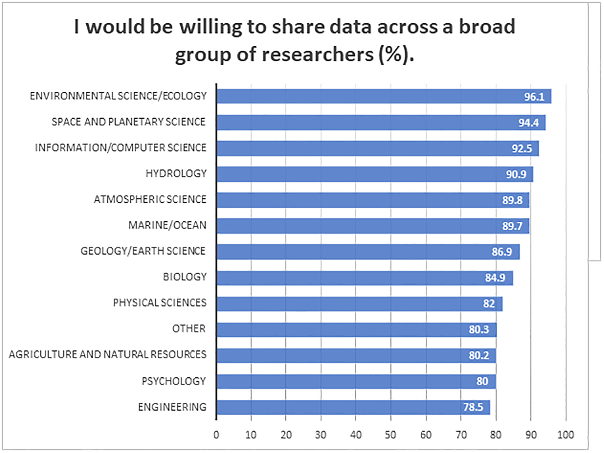
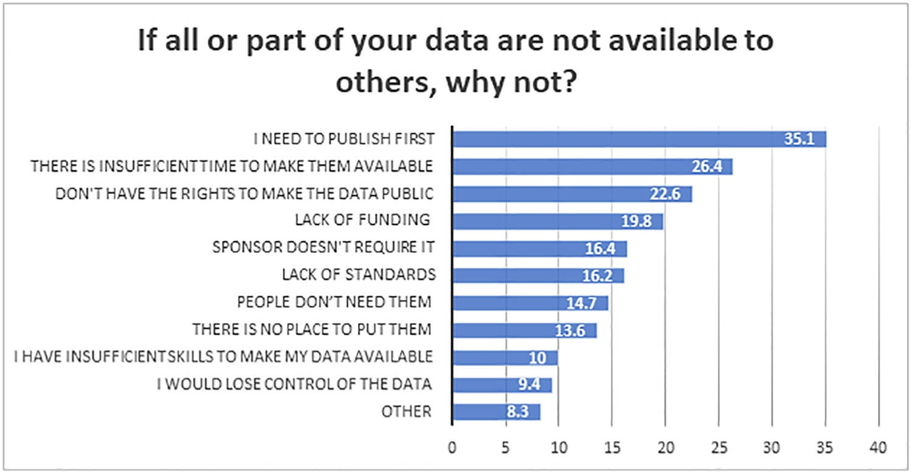

layout: true

background-image: url(http://geotec.uji.es/wp-content/uploads/2016/11/geotecLOGO.fw_.png)
background-position: left bottom
background-size: 15%


```{r setup, include=FALSE}
options(htmltools.dir.version = FALSE)
```

```{r load_refs, include=FALSE, cache=FALSE}
source("load_references.r")
```

---
class: inverse, center, middle

## You can't guarantee success, 

### but you can guarantee failure: never try.


---
class: inverse, center, middle

## What does research mean for a PhD thesis today?

---

# What does research mean for a PhD thesis today?

Claim #1 
> All published research today has a computational component.


Claim #2 
> There is a mismatch between the traditional scientific process and computation, leading to reproducibility concerns.

---

# What does research mean for a PhD thesis today?

What about you?:
- Is your research dependent on computation ?

- Which computational tools do you use? Do you use them sporadically or frequently? 

- In which phases do you use? 
  - data collection, data storage, data anlysis, data visualisation, 
  - writing, dissemination/presentation, communication

- Are general-purpose (Word, ...) or specific (SSPS,...) tools?

---

# What does research mean for a PhD thesis today?

Sequel of _Tenopir and colleagues_ on __data sharing__ in academia
- `r Cite(my_refs, "tenopir2011")`: _`r my_refs["tenopir2011"]$title`_

- `r Cite(my_refs, "tenopir2015")`: _`r my_refs["tenopir2015"]$title`_

- `r Cite(my_refs, "tenopir2020")`: _`r my_refs["tenopir2020"]$title`_

---
class: center, middle

# Tenopir et al. (2020) - Disciplines




---
class: center, middle

# Tenopir et al. (2020) - Barriers




---

# What does research mean for a PhD thesis today?

What about you?:
- Do your colleagues in your discipline share data?

- Do you share all or part of your data?

- Would you like to share data?

- Which are the main barriers you face to data sharing? 


---

# What does research mean for a PhD thesis today?

Claim #1 All published research today has a computational component.
> Computational reproducibility 


Claim #2 There is a mismatch between the traditional scientific process and computation, leading to reproducibility concerns.
> Transparent research

---
class: inverse, center, middle

## What does reproducibility mean for a PhD thesis?

---

# What does reproducibility mean for a PhD thesis?

If you’re not convinced yet, take a look at `r Cite(my_refs, "markowetz2015")`: _`r my_refs["markowetz2015"]$title`_

- reproducibility helps to avoid disaster

- reproducibility makes it easier to write papers

- reproducibility helps reviewers see it your way

- reproducibility enables continuity of your work

- reproducibility helps to build your reputation


---

# What's your choice?


- __Business as usual__ scenario, and irreproducible work remains the norm (see - `r Cite(my_refs["hong2015"])`)

.center[]


- Or you care about __transparency and reproducibility__, and you are excited to acquire new reproducible research practices and habits! 


---

# Discussion

Depending on your own interest and research topic, find a few additional informal readings
and blog posts in this [extensive collection about reproducibility in research](https://www.sciencegeist.ch/topic/reproducibility)

Write a list of obstacles for reproducibility that potentially apply to your work. Note
down a solution for each of them from the read articles

---

# References

```{r print_refs1, echo=FALSE, results="asis"}
PrintBibliography(my_refs)
```

 


