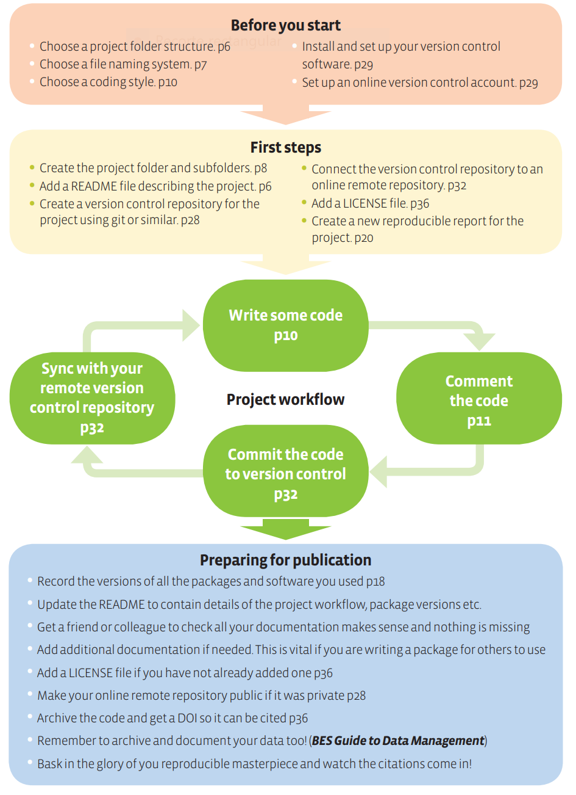

layout: true

background-image: url(http://geotec.uji.es/wp-content/uploads/2016/11/geotecLOGO.fw_.png)
background-position: left bottom
background-size: 15%


```{r setup, include=FALSE}
options(htmltools.dir.version = FALSE)
```

```{r load_refs, include=FALSE, cache=FALSE}
source("load_references.r")
```


---

# A simple reproducible project workflow

.pull-left[
.center[
]]

.pull-right[
- Top two boxes:
  
  - 02_02: Before you start 
]

---

# Prerrequisites


Remember: our focus is on __computational reproducibility__

Next practices mostly apply to those of you that have never coded 

If you code regularly, compare with yours and make your workflow more reproducible 

---
class: inverse

# Practices

--

##1 Folder organisation

--

##2 Use a consistent naming convention 

--

##3 Choose a coding style

--

##4 (Set-up and) use your version control system of choice

--

##5 (Set-up and) use your online code repository service of choice


---

#1 Folder organisation


- One folder = One project

- Choose your best way to organise a folder
  - Make sure it's consistent, informative and work for you 
 
  - My [folder template](https://github.com/cgranell/rr-template). _Explore & fork!_

---

#2 Consistent naming convention 


.pull-left[
.center[]

[Source](http://phdcomics.com/comics/archive.php?comicid=1531)
]

.pull-right[
- Name things in machine- and human-readable manner

- Order by default: 
  - For scrips, start file names with numbers indicating the position of the script in the analysis: `01_download_data.R`

  - for data, you can use dates as prefix: `20200115_survey.csv`
]

---

#3 Coding style 


Depends on the programming language of choice

Adopt a consistent coding style: 
- commenting code: the _'why'_ rather than the _'what'_

- writing functions

- naming variables

- portable code: avoid absolute paths; use relative paths 
  

---
#3 Coding style 

Relative paths with ([here package](https://cran.r-project.org/web/packages/here/index.html) in R)

```{r eval = FALSE, echo = TRUE}
library(here)

data_path <- here("data-raw")

data <- read_csv(data_path)
```

---

#4 Version control system  (VCS)

VCS advantages for reproduction:
- keeps track of the various versions of your work

- provides a complete historical log of your project 

- was designed to handling text format (code, text documents, markdown documents) as opposed to rich/binary formats (Word) 

Tools: SVN, Mercurial, [Git](https://git-scm.com/)

Further reading: [An introduction to Git: what it is, and how to use it](https://www.freecodecamp.org/news/what-is-git-and-how-to-use-it-c341b049ae61/) 

---

#5 Online code repositories services 

Web-based platform for hosting code repositories:
- VCS + collaborative features

- Platfoms: [GitLab](https://about.gitlab.com/), [Bitbucket](https://bitbucket.org/), [GitHub](https://github.com/)

Further readings:
- `r Cite(my_refs, "perez2016")`: _`r my_refs["perez2016"]$title`_

- [Cookiecutter Data Science](https://drivendata.github.io/cookiecutter-data-science/): _Best practices for organising your repository for easy version control_


---

# Summary

Simple, commonsense, and easy to apply practices. _Start using them from now on!_

Be organised and consistent is a great step to enabling reproduction
- No need to come up with new file/folder names for every new project

- Optimise your workflow

- Add progresively tools (git, github) into your workflow

---


# References (I)

```{r print_refs1, echo=FALSE, results="asis"}
PrintBibliography(my_refs)
```


