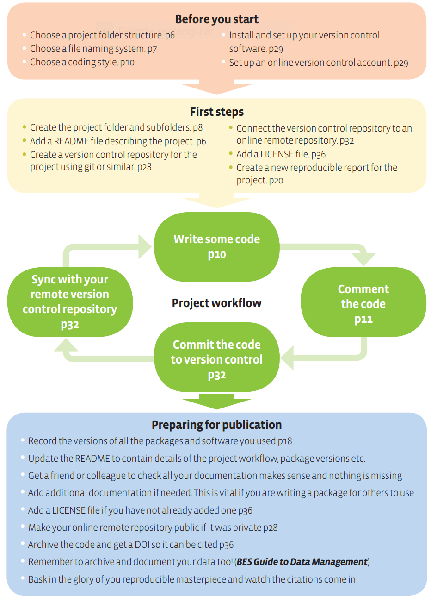

layout: true

background-image: url(http://geotec.uji.es/wp-content/uploads/2016/11/geotecLOGO.fw_.png)
background-position: left bottom
background-size: 15%


```{r setup, include=FALSE}
options(htmltools.dir.version = FALSE)
```

```{r load_refs, include=FALSE, cache=FALSE}
source("load_references.r")
```


---

# A simple reproducible project workflow

.pull-left[
.center[
]]

.pull-right[
- Top two boxes:

  - 02_03: First steps 
]

---
class: inverse

# Practices

--

##1 Create the project folder

--

##2 Create a (local) version control repository

--

##3 Connect the local repository to a remote repository

--

##4 Add a README file

--

##5 Add a LICENSE file


---

#1 Create the project folder 

Remember: one folder = one project

What's a project? 

- one experiment, 

- your ideas for future research,

- regular meeting notes/minutes 

- a review paper, conference presentations

- a book, teaching materials

- PhD thesis manuscript 
  
---

#1 Create the project folder 

Based on the [folder template](https://github.com/cgranell/rr-template):

- Star with a limited number of folders depending on the type of project

  - eg experiment: `data-raw` + `data` + `R` + `notes`

  - eg book: `doc` + `notes`

- Create new subfolders hierarchically as needed

  - eg: `data/spain`, `data/europe` 

- Include README files to describe metadata/complex content of subfolders


---

#2 Create a local version control repository 

Turn your project folder into a __local version control repository__ to track changes on your work 

After installing [Git](https://git-scm.com/book/en/v2/Getting-Started-Installing-Git) on your computer, you can either: 
- type sequence of commands in command-line interfaces (eg. commad prompt, shell)

- graphical interfaces integrated in your favorite development environment (eg. RStudio)

Dozens of resources by _googling_ [introduction to git](https://www.google.com/search?q=introduction+to+git)

---

#3 Connect local repository to a remote repository

**Sync** your local repository to a remote, collaborative code repository

If you work alone on a project, it's not necessary but recommended

If you work with others on the same project, it's a must

2-step workflow ([RStudio and Git/Github](https://happygitwithr.com/)): 
- Make a remote [repository in GitHub](https://happygitwithr.com/new-github-first.html#make-a-repo-on-github-1) 

- Make a [new RStudio project via git clone](https://happygitwithr.com/new-github-first.html#new-rstudio-project-via-git-clone)

  - _File > New Project > Version Control > Git_
  
---

#4 Add a README file 

Include a __README__ file in the root folder to describe the project, provide basic orientation to use the scritps, data, etc. 

Written in [Markdown](https://www.markdownguide.org/) markup language (later on Sessions 03-05)

Automatically visualised when landing on a GitHub repository

- eg. [folder template](https://github.com/cgranell/rr-template)

- eg. [review paper](https://github.com/cgranell/apps-mental-disorders-jmir)


---

#5 Add a LICENSE file

A license is a contract between the authors and the users. Without a license, **copyright** is automatically attached to your work 

**Always add a license** ([file](https://github.com/cgranell/rr-template/blob/master/LICENCE)) to software you plan to make public:
 - Permissive = attribution (recomended for academic work)

 - Copyleft = share-alike (derivate work maintain same license as the original)
 
Further readings:
- Visit [choosealicense](https://choosealicense.com/) or [OSI-approved licenses](https://opensource.org/licenses)

- `r Cite(my_refs, "morin2012")`: _`r my_refs["morin2012"]$title`_

- `r Cite(my_refs, "jolly2012")`: _`r my_refs["jolly2012"]$title`_

---


# References (I)

```{r print_refs1, echo=FALSE, results="asis"}
PrintBibliography(my_refs)
```


