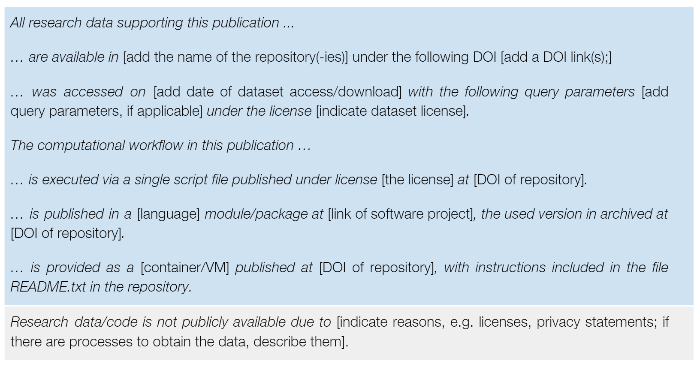
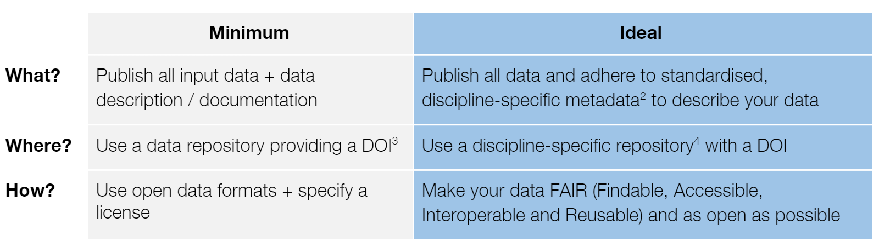
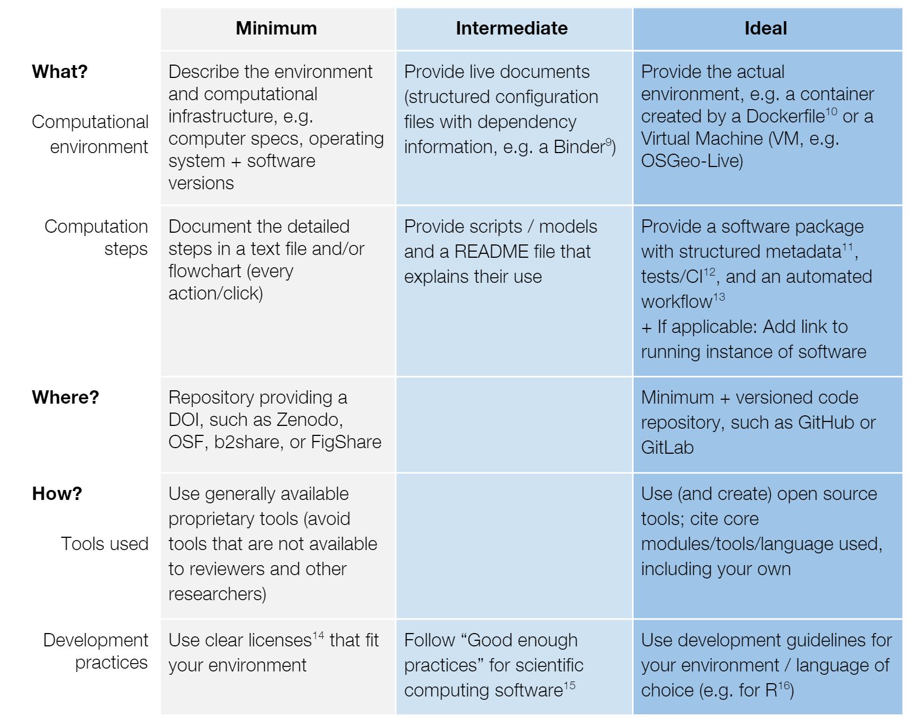

layout: true

background-image: url(http://geotec.uji.es/wp-content/uploads/2016/11/geotecLOGO.fw_.png)
background-position: left bottom
background-size: 15%


```{r setup, include=FALSE}
options(htmltools.dir.version = FALSE)
```

```{r load_refs, include=FALSE, cache=FALSE}
source("load_references.r")
```


---

# A simple reproducible project workflow

.pull-left[
.center[
]]

.pull-right[
- Bottom box

  - 04: RRP - Writing and dissemination
]]


---
class: inverse

# Practices

--

##1 Follow available practices and guidelines 

--

##2 Cite data/software in your papers 

---

#1 Follow practices and guidelines

In general: 

- Write your papers in plain text format (markdown, latex. etc) that permits version controls

- Use online tools ([manubot](https://manubot.org/)) or packages ([`rticles`](https://github.com/rstudio/rticles)) that support change tracking, reference management, cross-reference, etc.

In particular: 

- Follow _general enough_ practices and guidelines (across disciplines) 

- Follow specific guidelines in your discipline 

- Follow specific guidelines provided by target journals

---

#1 Follow practices and guidelines

Further readings:
- `r Cite(my_refs, "wilson2017")`: _`r my_refs["wilson2017"]$title`_

- `r Cite(my_refs, "rule2019")`: _`r my_refs["rule2019"]$title`_

- `r Cite(my_refs, "nust2018")`: _`r my_refs["nust2018"]$title`_

- `r Cite(my_refs, "stodden2014")`: _`r my_refs["stodden2014"]$title`_

---

#1 AGILE Guidelines [Nüst et al., 2018]

Add a **Data and Software Availability** section to your *methods* section to make explicit where data and software can be accessed (or why they cannot) - [Example](https://doi.org/10.2196/14897)

.center[]

---

#1 AGILE Guidelines - Data 

Go progressively from *minimun* to *ideal*  



---

#1 AGILE Guidelines - Code

.center[]


---

#2 Cite data/software 

If software/data are published as articles in journals, cite them as regular paper. 
Otherwise, use citation principles below.

Further readings:
- `r Cite(my_refs, "parsons2019")`: _`r my_refs["parsons2019"]$title`_

- `r Cite(my_refs, "callaghan2014")`: _`r my_refs["callaghan2014"]$title`_

- `r Cite(my_refs, "smith2016")`: _`r my_refs["smith2016"]$title`_

- `r Cite(my_refs, "stodden2014")`: _`r my_refs["stodden2014"]$title`_


---

# References (I)

```{r print_refs1, echo=FALSE, results="asis"}
PrintBibliography(my_refs, star=1, end=5)
```


---

# References (II)

```{r print_refs2, echo=FALSE, results="asis"}
PrintBibliography(my_refs, star=6, end=7)
```
